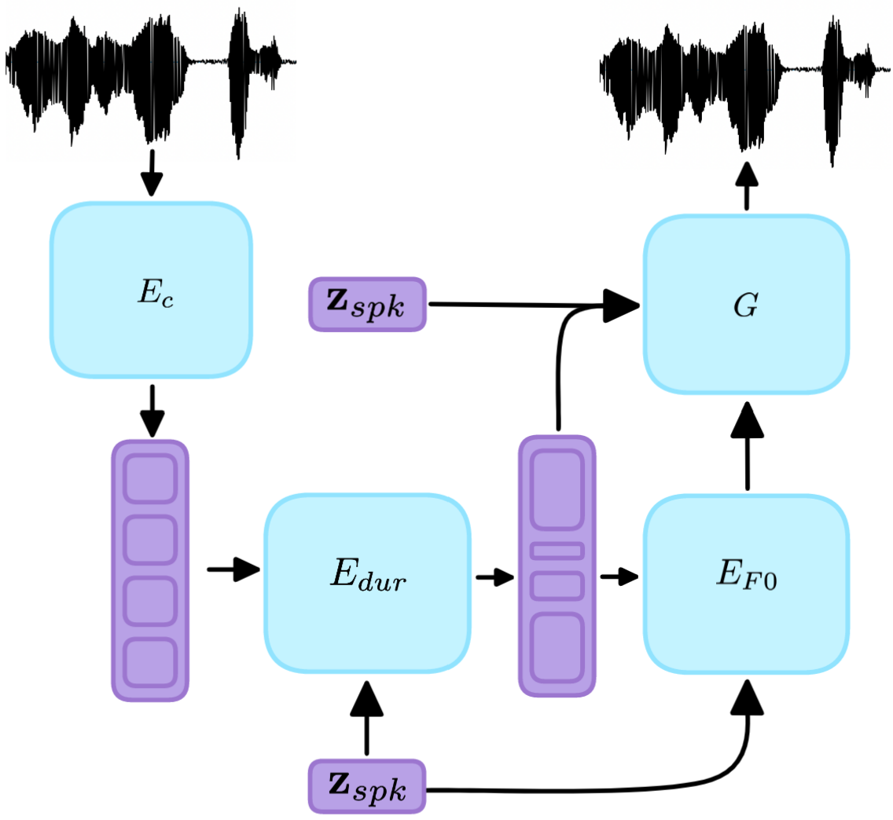

# Speaking Style Conversion With Discrete Self-Supervised Units
Official implementation of ["Speaking Style Conversion With Discrete Self-Supervised Units"](https://arxiv.org/abs/2212.09730), accepted at EMNLP 2023 (Findings).

  



__Abstract__: Voice conversion is the task of making a spoken utterance by one speaker sound as if uttered by a different speaker, while keeping other aspects like content the same. Existing methods focus primarily on spectral features like timbre, but ignore the unique speaking style of people which often impacts prosody. In this study we introduce a method for converting not only the timbre, but also the rhythm and pitch changes to those of the target speaker. In addition, we do so in the many-to-many setting with no paired data. We use pretrained, self-supervised, discrete units which make our approach extremely light-weight. We introduce a suite of quantitative and qualitative evaluation metrics for this setup, and show that our approach outperforms existing methods.

## Quick Links
* [Samples](https://pages.cs.huji.ac.il/adiyoss-lab/dissc/)
* [Setup](#setup)
* [Inference (with pretrained models)](#infer)
* [Evaluation (calculate metrics)](#evaluation)
* [Training](#train)
* [Citing DISSC](#reference)

## Setup
We present all setup requirements for running all parts of the code - including evaluation metrics, and all datasets. This adds further limitations which might not be mandatory otherwise, such as Montreal Forced Aligner requiring Conda installation because of Kaldi. You can also install requirements and download datasets by use.

### Environment
Create a conda environment, with python version 3.8 and install all the dependencies:
```sh
conda create -n dissc python=3.8
conda activate dissc

# download code
git clone https://github.com/gallilmaimon/DISSC.git

# install textlesslib, based on https://github.com/facebookresearch/textlesslib#installation
git clone https://github.com/facebookresearch/textlesslib.git
cd textlesslib
pip install -e .
pip install git+https://github.com/facebookresearch/fairseq.git@dd106d9534b22e7db859a6b87ffd7780c38341f8

# install requirements
cd ../DISSC
conda config --append channels conda-forge  # add needed channels
conda install --file requirements.txt
```

While certain other versions may be compatible as well, this was only tested with this setup.

### Data
We describe here how to download, preprocess and parse VCTK, Emotional Speech Dataset (ESD) and our synthetic dataset - Syn_VCTK.

#### For VCTK
1. Download the data from [here](https://datashare.ed.ac.uk/handle/10283/3443) and extract the audio to ```data/VCTK/wav_orig``` folder, and the text to ```data/VCTK/txt``` folder.
2. Preprocess the audio (downsample audio from 48 kHz to 16 kHz and pad). One could also trim silences to potentially improve results, but we do not do so.
```sh
python3 data/preprocess.py --srcdir data/VCTK/wav_orig --outdir data/VCTK/wav --pad --postfix mic2.flac
```

#### For ESD
1. Download the preprocessed data from [here](https://drive.google.com/file/d/1pX-G5geLLHc0852ZD_YlJwNa8_NKspaL/view?usp=share_link) to ```data/ESD``` folder.
2. If you want to preprocess this dataset from scratch, for instance if you wish to select different emotions for each speaker, download the entire dataset from [here](https://drive.google.com/file/d/1scuFwqh8s7KIYAfZW1Eu6088ZAK2SI-v/view).

#### For Syn_VCTK
1. Download the preprocessed data from [here](https://drive.google.com/file/d/1xOBGa-t2z8fSTU8aveVgiVsILdNVzvaG/view?usp=share_link) to ```data/Syn_VCTK``` folder.


## Infer
This section discusses how to perform speaking style conversion on a given sample with a trained model (in this case syn_vctk). We show the option of converting a sample of an unseen speaker (in the any-to-many) setup with a sample we recorded ourselves. For converting a subset of data from known speakers (such as the validation set), see the [evaluation](#evaluation) section.

### Any-to-Many
1. Preprocess the recording, resample to 16khz if needed and pad as needed:
```sh
python3 data/preprocess.py --srcdir data/unseen/wav_orig --outdir data/unseen/wav --pad --postfix .wav
```

2. Encode the sample with HuBERT:
```sh
python3 data/encode.py --base_dir data/unseen/wav --out_file data/unseen/hubert100/encoded.txt --device cuda:0
```

3. Download the pretrained models from [here](https://drive.google.com/drive/folders/1oTvW0lxIyrPuEUchfTBSXYpdNMUUXh6n?usp=share_link) to ```checkpoints/syn_vctk``` in the current file structure and all files from [here](https://drive.google.com/drive/folders/1LNP0u35EuBeGmXG5UIjyQnlWS78F2nGm?usp=share_link) to ```sr/checkpoints/vctk_hubert```.

4. Convert the prosody - rhythm (--pred_len option) and pitch contour (--pred_pitch option) using DISSC:
```sh
python3 infer.py --input_path data/unseen/hubert100/encoded.txt --out_path data/unseen/pred_hubert/ --pred_len --pred_pitch --len_model checkpoints/syn_vctk/len/ --f0_model checkpoints/syn_vctk/pitch/ --f0_path data/Syn_VCTK/hubert100/f0_stats.pkl --vc --target_speakers p231 p239 p245 p270 --wild_sample --id_to_spkr data/Syn_VCTK/hubert100/id_to_spkr.pkl
```

5. Convert the audio with speech-resynthesis in the new speakers' voice and style, for here we demonstrate with p231 from Syn_VCTK. Results are saved to ```dissc_p231```:
```sh
python3 sr/inference.py --input_code_file data/unseen/pred_hubert/p231_encoded.txt --data_path data/unseen/wav --output_dir dissc_p231 --checkpoint_file sr/checkpoints/vctk_hubert --unseen_speaker --id_to_spkr data/Syn_VCTK/hubert100/id_to_spkr.pkl --vc
```


## Evaluation
This section discusses how to evaluate the pretrained models on each of the datasets, first performing the SSC and then calculating all metrics. If you wish to manually inspect the different conversions, and alter the models, we suggest you see the ```scripts``` section and run the commands from there manually (or look at the [infer](#infer) section), these scripts are mainly meant as an "all-in-one" to wrap up key results.

### VCTK
1. Download the pretrained DISSC model from [here](https://drive.google.com/drive/folders/1nsT-2d8q_6uLVHXJSjO6GHBFMEE_xWse?usp=share_link) to ```checkpoints/vctk```, and the pretrained vocoder from [here](https://drive.google.com/drive/folders/1LNP0u35EuBeGmXG5UIjyQnlWS78F2nGm?usp=share_link) to ```sr/checkpoints/vctk_hubert``` (if you haven't done so yet).

2. Encode the dataset using HuBERT, and perform train-val split:
```sh
python3 data/encode.py --base_dir data/VCTK/wav --out_file data/VCTK/hubert100/encoded.txt --device cuda:0
python3 data/prep_dataset.py --encoded_path data/VCTK/hubert100/encoded.txt --stats_path data/VCTK/hubert100/f0_stats.pkl --split_method paired_val
```

3. We give a single script which runs the conversion (predicts prosody + generates with SR), then restructures the file format for evaluation. It then runs MFA to align the text to the audio, as used for metrics and runs all metrics other than speaker verification. For more details, see the script. Results are printed and also saved as a pickle file.
```sh
python3 scripts/convert_eval.py --dissc_type dissc_l --data vctk --sort_gt  # Rhythm only
python3 scripts/convert_eval.py --dissc_type dissc_b --data vctk            # Convert Rhythm and Pitch
python3 scripts/convert_eval.py --dissc_type dissc_p --data vctk            # Pitch only - not in original paper
```

4. Download the speaker verification table, which describes the pairs, from [here](https://drive.google.com/file/d/1b8d5vJQhUixfb7615DIno0T9MisYu4PG/view?usp=share_link) to ```data/VCTK/```.

5. Evaluate speaker verification. Also here we give a single script which runs the conversion (predicts prosody + generates with SR), then restructures the file format for evaluation. For more details, see the script. Results for EER are printed.
```sh
python3 scripts/convert_eval_sv.py --dissc_type dissc_l --data vctk  # Rhythm only
python3 scripts/convert_eval_sv.py --dissc_type dissc_b --data vctk  # Convert Rhythm and Pitch
```

### ESD
1. Download the pretrained DISSC model from [here](https://drive.google.com/drive/folders/1ZNT9cyK5CPwFQzu6WY2c4wS56fNQf57a?usp=share_link) to ```checkpoints/esd```, and the pretrained vocoder from [here](https://drive.google.com/drive/folders/1kHbBRVVhGcTCGc20NuEMNo_hMlS6CUs-?usp=share_link) to ```sr/checkpoints/esd_hubert```.

2. Encode the dataset using HuBERT, and perform train-val split:
```sh
python3 data/encode.py --base_dir data/ESD/wav/train --out_file data/ESD/hubert100/train.txt --device cuda:0
python3 data/encode.py --base_dir data/ESD/wav/evaluation --out_file data/ESD/hubert100/val.txt --device cuda:0
python3 data/encode.py --base_dir data/ESD/wav/paired_test --out_file data/ESD/hubert100/test.txt --device cuda:0
python3 data/prep_dataset.py --encoded_path data/ESD/hubert100/train.txt --stats_path data/ESD/hubert100/f0_stats.pkl
```

3. We give a single script which runs the conversion (predicts prosody + generates with SR), then restructures the file format for evaluation. It then runs MFA to align the text to the audio, as used for metrics and runs all metrics other than speaker verification. For more details, see the script. Results are printed and also saved as a pickle file.
```sh
python3 scripts/convert_eval.py --dissc_type dissc_l --data esd --sort_gt  # Rhythm only
python3 scripts/convert_eval.py --dissc_type dissc_b --data esd            # Convert Rhythm and Pitch - not in original paper
python3 scripts/convert_eval.py --dissc_type dissc_p --data esd            # Pitch only - not in original paper
```

4. Download the speaker verification table, which describes the pairs, from [here](https://drive.google.com/file/d/1TsLjLz9aU_Mj892v88j8ohRY1lJWV5Vk/view?usp=share_link) to ```data/ESD/```.

5. Evaluate speaker verification. Also here we give a single script which runs the conversion (predicts prosody + generates with SR), then restructures the file format for evaluation. For more details, see the script. Results for EER are printed.
```sh
python3 scripts/convert_eval_sv.py --dissc_type dissc_l --data esd  # Rhythm only
```

### Syn_VCTK
1. Download the pretrained DISSC model from [here](https://drive.google.com/drive/folders/1oTvW0lxIyrPuEUchfTBSXYpdNMUUXh6n?usp=share_link) to ```checkpoints/syn_vctk```, and the pretrained vocoder from [here](https://drive.google.com/drive/folders/1LNP0u35EuBeGmXG5UIjyQnlWS78F2nGm?usp=share_link) to ```sr/checkpoints/vctk_hubert``` (if you haven't done so yet, this is the same as the VCTK vocoder).

2. Encode the dataset using HuBERT, and perform train-val split:
```sh
python3 data/encode.py --base_dir data/Syn_VCTK/wav --out_file data/Syn_VCTK/hubert100/encoded.txt --device cuda:0
python3 data/prep_dataset.py --encoded_path data/Syn_VCTK/hubert100/encoded.txt --stats_path data/Syn_VCTK/hubert100/f0_stats.pkl --split_method paired_val
```

3. We give a single script which runs the conversion (predicts prosody + generates with SR), then restructures the file format for evaluation. It then runs MFA to align the text to the audio, as used for metrics and runs all metrics other than speaker verification. For more details, see the script. Results are printed and also saved as a pickle file.
```sh
python3 scripts/convert_eval.py --dissc_type dissc_b --data syn_vctk --sort_gt  # Convert Rhythm and Pitch
python3 scripts/convert_eval.py --dissc_type dissc_l --data syn_vctk            # Rhythm only
python3 scripts/convert_eval.py --dissc_type dissc_p --data syn_vctk            # Pitch only
```


## Train
This section discusses how to train the models from scratch, as in the paper. We encourage you to test out other configurations as well. This assumes you have downloaded and prepared the datasets (including train-test split) as described in the previous sections.

### Pitch Predictor
These models should take around 30 minutes to train on a single GPU.
- VCTK, this is with the version with no positional encoding to match the paper:
```sh
python3 train_f0_predictor.py --out_path checkpoints/vctk --data_path data/VCTK/hubert100/ --f0_path data/VCTK/hubert100/f0_stats.pkl --model_type base --n_epochs 20
```
- ESD, this is with the version with no positional encoding to match the paper:
```sh
python3 train_f0_predictor.py --out_path checkpoints/esd --data_path data/ESD/hubert100/ --f0_path data/ESD/hubert100/f0_stats.pkl --model_type base --n_epochs 20
```
- Syn_VCTK:
```sh
python3 train_f0_predictor.py --out_path checkpoints/syn_vctk --data_path data/Syn_VCTK/hubert100/ --f0_path data/Syn_VCTK/hubert100/f0_stats.pkl --model_type new --n_epochs 20
```

### Rhythm Predictor
These models should take around 30 minutes to train on a single GPU.
- VCTK:
```sh
python3 train_len_predictor.py --out_path checkpoints/vctk --data_path data/VCTK/hubert100/ --n_epochs 30
```
- ESD, this is with the version with no positional encoding to match the paper:
```sh
python3 train_f0_predictor.py --out_path checkpoints/esd --data_path data/ESD/hubert100/ --n_epochs 30
```
- Syn_VCTK. Note that the paper version uses VCTK rhythm predictor for syn_vctk as it is a larger dataset with identical rhythm for the speakers, if you nevertheless wish to train one:
```sh
python3 train_f0_predictor.py --out_path checkpoints/syn_vctk --data_path data/Syn_VCTK/hubert100/ --n_epochs 30
```

### Vocder
Training this model is based on Speech-Resynthesis with minor adjustments. Training it will take a couple of days on 2 GPUs. Update the number of available GPUs in the config files under ```sr/configs```, and in the run command. Also make sure the data paths in the config files match yours. After training, go to the checkpoint path configuration, and change the normalisation to false.
- VCTK:
```sh
python3 -m torch.distributed.launch --nproc_per_node <NUM_GPUS> sr/train.py --checkpoint_path sr/checkpoints/vctk_hubert --config sr/configs/VCTK/hubert100_lut.json
```
- ESD:
```sh
python3 -m torch.distributed.launch --nproc_per_node <NUM_GPUS> sr/train.py --checkpoint_path sr/checkpoints/esd_hubert --config sr/configs/ESD/hubert100_lut.json
```
- Syn_VCTK uses the same vocoder as VCTK.

## Reference
If you found this code useful, we would appreciate you citing the related paper
```bib
@inproceedings{maimon-adi-2023-speaking,
    title = "Speaking Style Conversion in the Waveform Domain Using Discrete Self-Supervised Units",
    author = "Maimon, Gallil  and
      Adi, Yossi",
    editor = "Bouamor, Houda  and
      Pino, Juan  and
      Bali, Kalika",
    booktitle = "Findings of the Association for Computational Linguistics: EMNLP 2023",
    month = dec,
    year = "2023",
    address = "Singapore",
    publisher = "Association for Computational Linguistics",
    url = "https://aclanthology.org/2023.findings-emnlp.541",
    pages = "8048--8061",
    abstract = "We introduce DISSC, a novel, lightweight method that converts the rhythm, pitch contour and timbre of a recording to a target speaker in a textless manner. Unlike DISSC, most voice conversion (VC) methods focus primarily on timbre, and ignore people{'}s unique speaking style (prosody). The proposed approach uses a pretrained, self-supervised model for encoding speech to discrete units, which makes it simple, effective, and fast to train. All conversion modules are only trained on reconstruction like tasks, thus suitable for any-to-many VC with no paired data. We introduce a suite of quantitative and qualitative evaluation metrics for this setup, and empirically demonstrate that DISSC significantly outperforms the evaluated baselines. Code and samples are available at https://pages.cs.huji.ac.il/adiyoss-lab/dissc/.",
}
```
